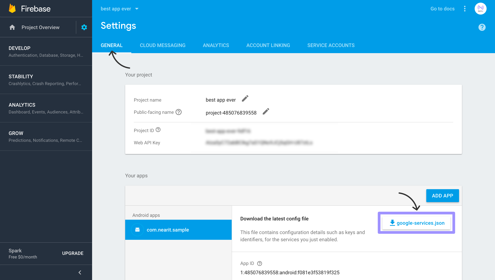

# Push Notifications (Android)

To enable push notification you will need to integrate **Google Firebase** in your app:
  
**1.** If you don't already have a **Firebase project**, create one at [Google Firebase Console](https://console.firebase.google.com/). 
Inside the project, select **"Add Firebase to your Android app"** (make sure to enter the right package name of your app).
  
**2.** Download `google-services.json` file to your computer and add the file in your Android component.
 

  
Select properties on that file and specify the following **“Build Action>GoogleServicesJson”**. If that **Build Action** is not available simply close and re-open the solution.

**3.** Copy your project ***FCM Cloud Messaging Server Key*** from [Google Firebase Console](https://console.firebase.google.com/)
(See the screenshot below and make sure to use the right api key)

 

**4.** Open [NearIT](https://go.nearit.com), select your app and navigate to **“Settings > Push Settings”**.
Paste your project FCM Key under the **“Setup Android push notifications”** block.

  
___
**WARNING**: Do not follow any further FCM-specific instructions: we automatically handle all the other part of the process inside the SDK code.
___

 
The SDK creates a system notification for every push recipe it receives. 
On the notification tap, your launcher activity will start. 
To learn how to deal with in-app content once the user taps on the notification, see this [section](in-app-content.md).

___
**WARNING**: If you experience build or runtime problems with google play services components, make sure you are not including multiple versions of the google play services. 
NearIT includes the 11.4.0 version. Conflicting play services version may result in compile-time and run-time errors.
